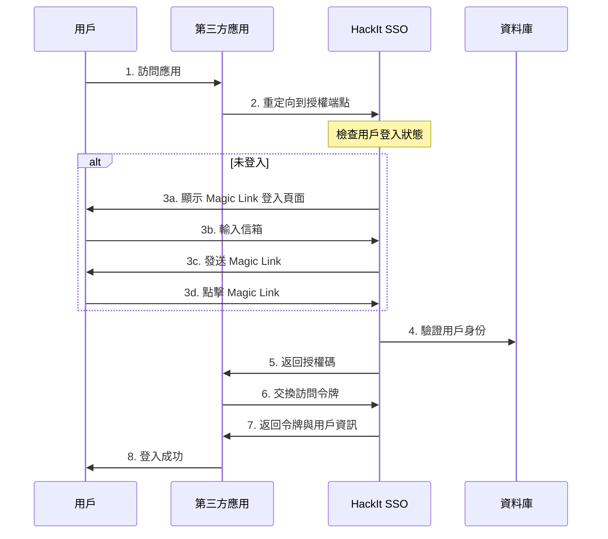

# HackIt SSO - OpenID Connect (OIDC) Integration Guide

## 概述

HackIt SSO 現在完全支援 OpenID Connect (OIDC) 標準，允許第三方應用程式（如 Outline Wiki、GitLab、Grafana 等）使用 HackIt 帳戶進行無縫登入。

## 🚀 快速開始

### 1. 註冊 OIDC 客戶端

⚠️ **重要：OIDC 客戶端註冊需要管理員金鑰認證**

使用提供的註冊工具：

```bash
python register_oidc_client.py
```

或手動 POST 請求（需要管理員金鑰）：

```bash
curl -X POST https://sso.hackit.tw/oidc/register \
  -H "Content-Type: application/json" \
  -H "Authorization: Bearer YOUR_OIDC_ADMIN_KEY" \
  -d '{
    "client_id": "your-app-id",
    "client_secret": "your-generated-secret",
    "client_name": "Your Application Name",
    "redirect_uris": ["https://yourapp.hackit.tw/auth/callback"],
    "grant_types": ["authorization_code", "refresh_token"],
    "response_types": ["code"],
    "scope": "openid profile email"
  }'
```

**環境變數設定：**
管理員需要在伺服器上設定 `OIDC_ADMIN_KEY` 環境變數：
```bash
OIDC_ADMIN_KEY=your-secure-admin-key-here
```

### 2. OIDC 端點資訊

| 端點 | URL |
|------|-----|
| 探索文檔 | `https://sso.hackit.tw/.well-known/openid-configuration` |
| 授權端點 | `https://sso.hackit.tw/oidc/authorize` |
| 令牌端點 | `https://sso.hackit.tw/oidc/token` |
| 用戶資訊端點 | `https://sso.hackit.tw/oidc/userinfo` |
| 登出端點 | `https://sso.hackit.tw/oidc/endsession` |
| JWKS 端點 | `https://sso.hackit.tw/oidc/jwks` |

## 📖 OIDC 流程說明

### 標準授權碼流程



## 🔧 應用程式整合

### Outline Wiki

在 Outline 的環境變數中設置：

```env
# OIDC Configuration
OIDC_CLIENT_ID=outline-wiki
OIDC_CLIENT_SECRET=your-generated-secret
OIDC_AUTH_URI=https://sso.hackit.tw/oidc/authorize
OIDC_TOKEN_URI=https://sso.hackit.tw/oidc/token
OIDC_USERINFO_URI=https://sso.hackit.tw/oidc/userinfo
OIDC_LOGOUT_URI=https://sso.hackit.tw/oidc/endsession
OIDC_DISPLAY_NAME=HackIt SSO
OIDC_SCOPES=openid profile email
```

### GitLab

在 GitLab 管理員設置中：

1. 前往 **Admin Area** > **Settings** > **Sign-in restrictions**
2. 展開 **Sign-in restrictions** 部分
3. 添加 OIDC 配置：

```yaml
# GitLab OIDC 配置
oidc:
  enabled: true
  name: 'HackIt SSO'
  identifier: 'your-gitlab-client-id'
  secret: 'your-generated-secret'
  redirect_uri: 'https://gitlab.hackit.tw/users/auth/oidc_generic/callback'
  issuer: 'https://sso.hackit.tw'
  discovery: true
  client_auth_method: 'client_secret_basic'
  scope: ['openid', 'profile', 'email']
  response_type: 'code'
  uid_field: 'sub'
  send_scope_to_token_endpoint: false
  client_options:
    identifier: 'your-gitlab-client-id'
    secret: 'your-generated-secret'
    redirect_uri: 'https://gitlab.hackit.tw/users/auth/oidc_generic/callback'
```

### Grafana

在 Grafana 配置檔 `grafana.ini` 中：

```ini
[auth.generic_oauth]
enabled = true
name = HackIt SSO
allow_sign_up = true
client_id = your-grafana-client-id
client_secret = your-generated-secret
scopes = openid profile email
auth_url = https://sso.hackit.tw/oidc/authorize
token_url = https://sso.hackit.tw/oidc/token
api_url = https://sso.hackit.tw/oidc/userinfo
login_attribute_path = preferred_username
name_attribute_path = name
email_attribute_path = email
```

### Nextcloud

在 Nextcloud 管理設置中安裝 **OpenID Connect Login** 應用：

```php
// config.php 添加
'oidc_login_provider_url' => 'https://sso.hackit.tw',
'oidc_login_client_id' => 'your-nextcloud-client-id',
'oidc_login_client_secret' => 'your-generated-secret',
'oidc_login_auto_redirect' => false,
'oidc_login_end_session_redirect' => false,
'oidc_login_button_text' => 'Login with HackIt SSO',
'oidc_login_hide_password_form' => false,
'oidc_login_use_id_token' => true,
'oidc_login_attributes' => array(
    'id' => 'sub',
    'name' => 'name',
    'mail' => 'email',
    'login' => 'preferred_username',
),
'oidc_login_default_group' => 'oidc',
'oidc_login_use_external_storage' => false,
'oidc_login_scope' => 'openid profile email',
'oidc_login_proxy_ldap' => false,
'oidc_login_disable_registration' => true,
'oidc_login_redir_fallback' => false,
'oidc_login_alt_login_page' => 'assets/login.php',
'oidc_login_tls_verify' => true,
```

## 🔒 安全特性

### 1. JWT 簽名驗證
- 使用 RS256 (RSA + SHA256) 算法
- 自動生成和管理 RSA 金鑰對
- 支援金鑰輪換

### 2. 客戶端認證
- 支援 `client_secret_basic` 和 `client_secret_post`
- 強制使用 HTTPS
- 重定向 URI 白名單驗證

### 3. 授權碼保護
- 10 分鐘過期時間
- 一次性使用
- 與客戶端和重定向 URI 綁定

### 4. 令牌管理
- Access Token: 1 小時有效期
- Refresh Token: 30 天有效期
- ID Token: 包含完整用戶資訊

## 📋 支援的 Claims

### ID Token Claims

```json
{
  "iss": "https://sso.hackit.tw",
  "sub": "user-unique-id",
  "aud": "client-id",
  "exp": 1640995200,
  "iat": 1640991600,
  "auth_time": 1640991600,
  "nonce": "random-nonce-value",
  "email": "user@hackit.tw",
  "email_verified": true,
  "name": "使用者全名",
  "given_name": "名",
  "family_name": "姓",
  "picture": "base64-encoded-avatar",
  "preferred_username": "user@hackit.tw",
  "locale": "zh-TW"
}
```

### UserInfo Response

```json
{
  "sub": "user-unique-id",
  "name": "使用者全名", 
  "given_name": "名",
  "family_name": "姓",
  "email": "user@hackit.tw",
  "email_verified": true,
  "picture": "base64-encoded-avatar",
  "preferred_username": "user@hackit.tw",
  "locale": "zh-TW",
  "updated_at": 1640991600
}
```

## 🛠️ 開發工具

### 測試 OIDC 探索端點

```bash
curl https://sso.hackit.tw/.well-known/openid-configuration | jq
```

### 驗證 JWT Token

```bash
# 獲取 JWKS
curl https://sso.hackit.tw/oidc/jwks | jq

# 使用 jwt.io 或其他工具驗證 token
```

### Debug 模式

在開發環境中，可以使用以下端點查看客戶端資訊：

```bash
curl https://sso.hackit.tw/oidc/clients/your-client-id
```

## 🔄 令牌刷新

使用 Refresh Token 獲取新的 Access Token：

```bash
curl -X POST https://sso.hackit.tw/oidc/token \
  -H "Content-Type: application/x-www-form-urlencoded" \
  -d "grant_type=refresh_token&refresh_token=your-refresh-token&client_id=your-client-id&client_secret=your-client-secret"
```

## ❗ 常見問題

### Q: 如何處理 Magic Link 與 OIDC 的整合？

A: 當用戶通過 OIDC 流程進入 SSO 系統時，系統會：
1. 保存 OIDC 參數（client_id, redirect_uri, state 等）
2. 顯示 Magic Link 登入介面
3. 用戶驗證後自動生成授權碼
4. 重定向回原始應用程式

### Q: 如何自定義用戶屬性映射？

A: 目前系統提供標準的 OIDC Claims，如需自定義映射，請在應用程式端處理，或聯繫管理員添加特定的 Claims。

### Q: 如何處理用戶登出？

A: OIDC 規範中的登出處理需要在應用程式端實現。HackIt SSO 提供的是無狀態 JWT，因此登出主要是清除本地 token。

### Q: 支援哪些 Grant Types？

A: 目前支援：
- `authorization_code`（主要流程）
- `refresh_token`（令牌刷新）

### Q: 如何配置多個重定向 URI？

A: 在註冊客戶端時，`redirect_uris` 接受陣列格式：

```json
{
  "redirect_uris": [
    "https://app1.hackit.tw/callback",
    "https://app2.hackit.tw/auth/callback",
    "http://localhost:3000/callback"
  ]
}
```

## 📞 技術支援

如需技術支援或有任何問題，請：

1. 查看系統日誌：檢查 SSO 服務器日誌獲取詳細錯誤信息
2. 驗證配置：確保所有 OIDC 參數正確設置
3. 測試連通性：確保網路連接和 DNS 解析正常
4. 聯繫管理員：提供詳細的錯誤信息和配置內容

## 🔗 相關資源

- [OpenID Connect Core 1.0](https://openid.net/specs/openid-connect-core-1_0.html)
- [RFC 6749 - OAuth 2.0](https://tools.ietf.org/html/rfc6749)
- [JWT.io - JWT Debugger](https://jwt.io/)
- [OIDC Debugger](https://oidcdebugger.com/)

---

**HackIt SSO Team**  
最後更新：2025-01-12 